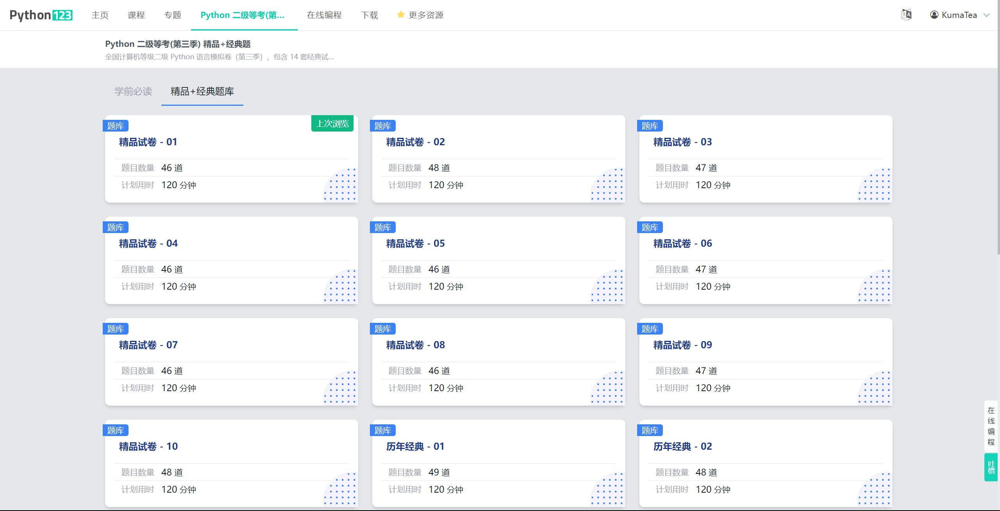
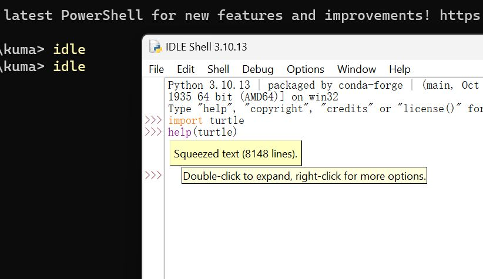
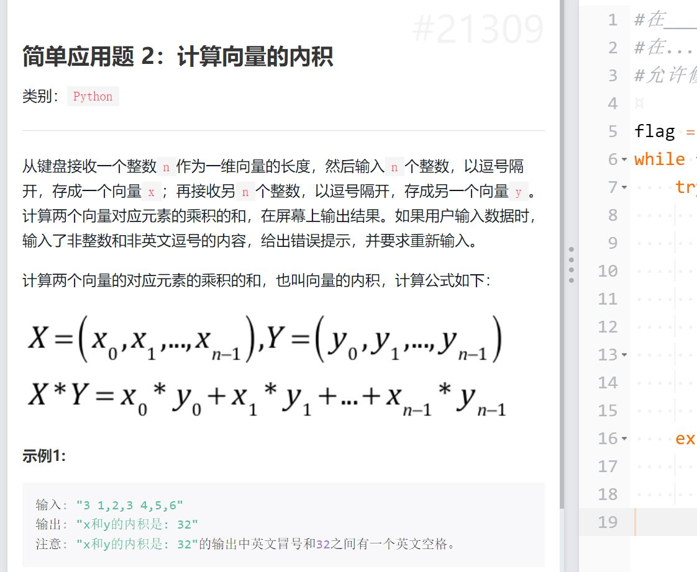

# 全国计算机等级考试 (NCRE)

* 等级：二级
* 科目：Python

## 信息

* 通过　　：[是](https://twitter.com/KumaTea0/status/1719686400965255438)
* 尝试次数：1
* 时间　　：2023-03
* 最高成绩：优秀
* 速通花费：3天
* 难度　　：★★☆☆☆

## 速通流程

本文默认读者已有相当的 Python 编程经验，二级是考着玩的。
如果是抱着学习新知识或者提升自我的目的，那么不适用速通，请认真学习夯实基础。

当前试题结构为：

* 单选 * 40 (40 * 1 = 40)
  * 基础 * 10
  * Python * 30
* 基本操作 * 3 (3 * 5 = 15)
* Turtle 绘图 * 1 (1 * 10 = 10)
* 简单应用 * 2 (5 + 10 = 15)
* 综合应用 * 3 (5 + 5 + 10 = 20)

### 记忆力好的人

直接打开 [Python123](https://www.python123.io)，
把题目和答案记下来就行了。

没有广告费实在不想打广告，但我只说两个字：原题。

### 我的经验

首先 [Python123 的钱还是要花的](https://twitter.com/KumaTea0/status/1501876407680614402)，比报名费便宜。

#### 公共基础知识

如果你的目标是过而不是高分，直接跳过。

因为我不是计算机专业，基础约等于零，所以先找了份总结来看。

* [全国计算机等级考试二级公共基础知识资料](https://www.bilibili.com/read/cv18696250/)

看一遍，有个大致印象就行，力求理解，避免记忆。
需要死记硬背的跳过；太复杂以至于没法短时间搞懂的，比如二叉树跳过；
再次强调，这不是重点，控制时间在2分钟内。

#### 选择题

注意：

1. 选择题必须提交后才能做大题，且提交后不可修改
2. 做选择题时没有 IDLE，只能脑内调试

前10道基础题上方已提及。

后30道 Python 题，难度不大，细心即可。

Python123 共有26份试卷，时间充裕可全刷一遍，时间不够就只做前10道基础题。

#### 基本操作

包含字符串、列表等基本数据结构的操作，内置数学函数的运用等。考验基础扎实程度。

我的基础非常薄弱，尤其是字符串的切片 (`'ybureven'[::-1]`)、格式化 (`f'{114.514:.2f}'`) 等。
好在有 IDLE，总能试出来。

#### Turtle 绘图

Turtle 可谓二级要求中最没有使用价值的一个库了。

备考难度不高，记住提笔落笔、设置颜色、移动旋转、等基本操作即可。

记不住也没事，直接 `help(turtle)` 慢慢看。

#### 应用题

可能单纯考察 list 或 dict 的操作，
可能包含文件的读写 (纯文本或 `csv`)，
可能包含 `jieba` 的考察。

难度较低，如果平常经常使用 Python 做一些提升效率的小工具，
甚至像我一样玩 Telegram Bot 的话，基本是信手拈来。

不要被题目吓到。比如这一道，看着很恐怖
(如果你和我一样大学不学数学)
其实就是分别加起来而已。

### 怎么考高分

把 Python123 大题过一遍就行。

原题的意思就是我考的每道大题都是做过的原题。
