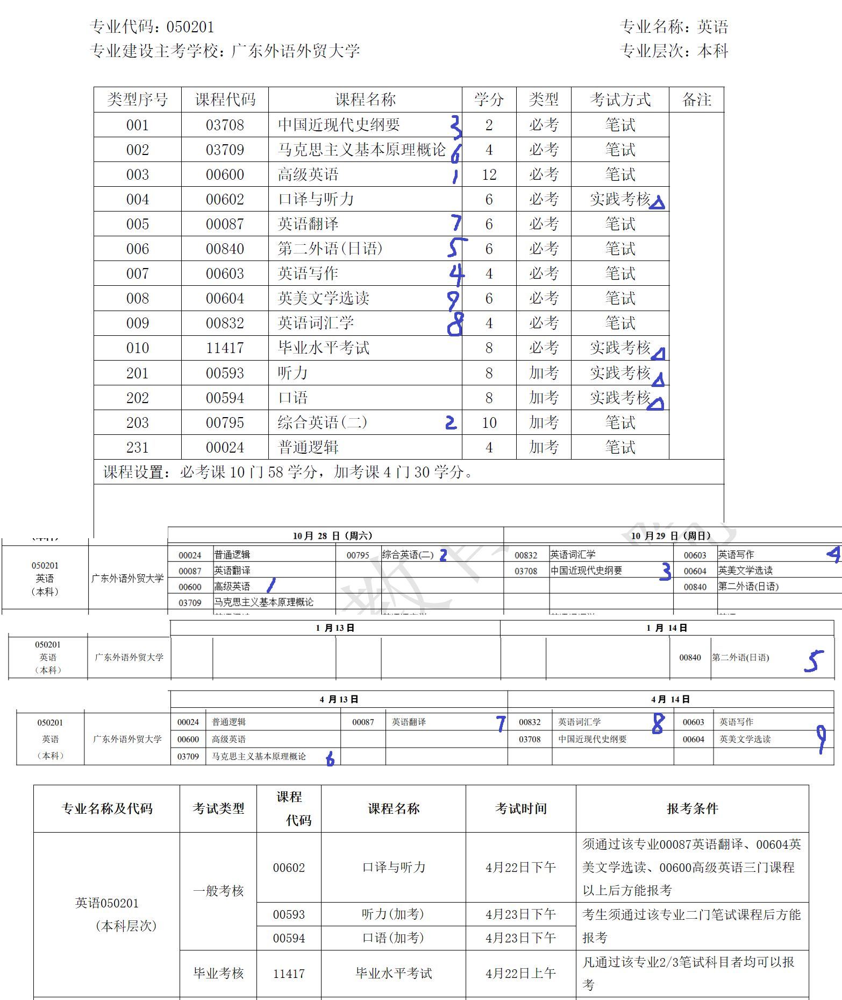

# 高等教育自学考试

* 科目：英语
* 代码：050201
* 报名：2023年10月
* 进度：3/10 ([减负](https://www.eeagd.edu.cn/selfec/main/ksgg.jsp?ggxh=195)后)

## 考试计划

上图为减负前计划，减负后考试计划不变。

## 前言

本篇默认读者英语水平至少为大学英语六级以上。

我的报考动机不是提升学历，而是因为在本科学习中遭遇重大、完全的失败，
因而想要通过社会考试验证自己的智力、学力是否正常。

经对比筛选，英语自考本科是考试科目最少的专业
(减负前 8 + 2 + 1 + 2 = 13，减负后 8 + 2 = 10)，
性价比最高，因而欣然选择。

如果你选择的专业不是英语，那么本文不一定适合你；
如果是英语，但是是以提升学历为目的，那么本文绝对不适合，请踏实从多背单词多阅读开始。
